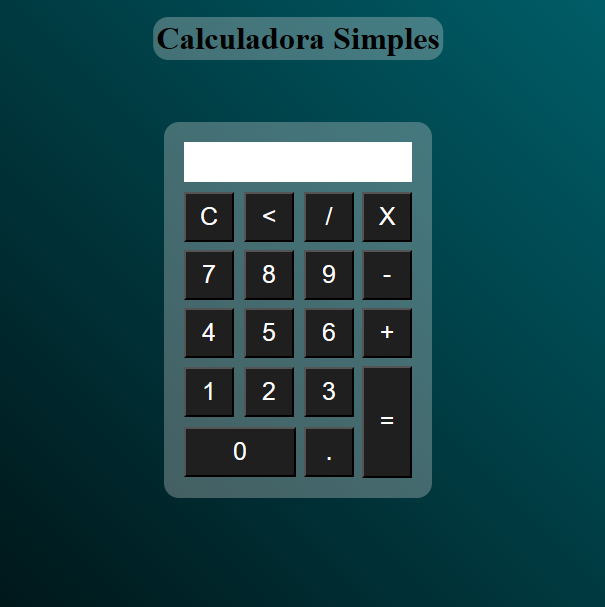

<h1 align="center"> Calculadora </h1>

 

Esta calculadora foi desenvolvida com o intuito de praticar meus conhecimentos em HTML, CSS e JavaScript.

  

## Teste a Calculadora

<a href="https://pedrodom0901.github.io/calculadora-simples/" target="_blank"> Click aqui </a>

## Tecnologias

Esse projeto foi desenvolvido com as seguintes tecnologias:

- HTML,CSS e JavaScript
- Git e Github
